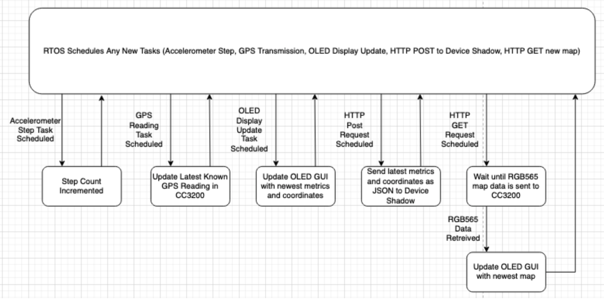
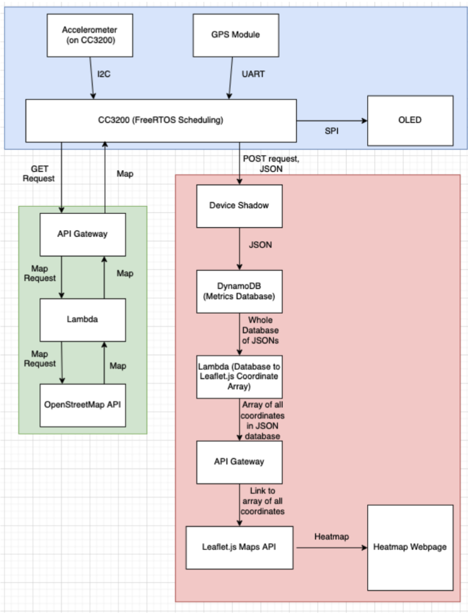
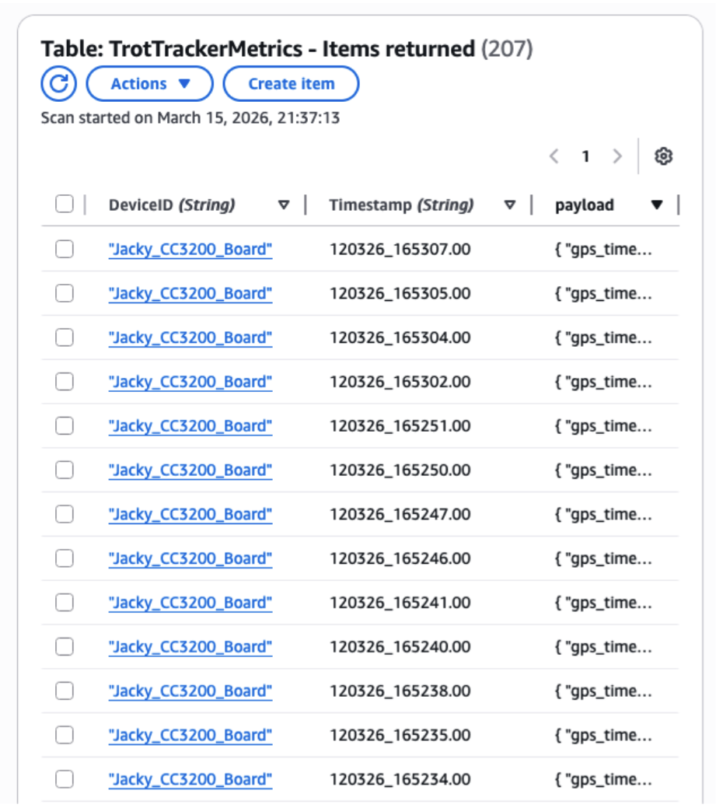

# TrotTracker

## Table of Contents
- [Link to Heatmap](#link-to-heatmap)
- [Demo](#demo)
- [Description](#description)
- [Design](#design)
  - [Functional Specifications](#functional-specifications)
  - [System Architecture](#system-architecture)
- [Implementation](#implementation)
  - [I2C Accelerometer Step Counting](#i2c-accelerometer-step-counting)
  - [GPS Module Decoding](#gps-module-decoding)
  - [FreeRTOS Task Scheduling](#freertos-task-scheduling)
  - [Downloading & Displaying a Map Onto the OLED Display](#downloading--displaying-a-map-onto-the-oled-display)
  - [Heatmap Display](#heatmap-display)
- [Challenges](#challenges)
- [Future Work](#future-work)
- [Bill of Materials](#bill-of-materials)

## Link to Heatmap
<a href="./heatmap.html"> Click here to access the heatmap </a>

Please note that it may take some time for the hotspots to load.

## Demo
<video width="640" height="360" controls>
  <source src="assets/demo.mp4" type="video/quicktime">
  video
</video>

## Description
TrotTracker is a smart wearable device that allows users to be able to track their movement by foot. Users will be able to see where they are located, how many steps they have taken, the speed of their movement, as well as a heatmap hosted on a custom website to see where they have been for the longest time. It can be used by a variety of people ranging from casual urban walkers to hikers.

## Design
### Functional Specifications

The TrotTracker is a device which performs 3 tasks:
1. Display the user’s step count accumulated for the duration the device is powered on as well as the user’s current longitude and latitude
2.  Display a map of the nearby area on the OLED based on the user’s current geographical location
3.  Build a heatmap of the user’s locations which is accessible on an online webpage

As shown in the state machine diagram shown above, these tasks are essentially all performed through scheduling five tasks in RTOS, some on interrupt and some periodically. These tasks are:
1. Incrementing the step count upon receiving an interrupt indicating a significant step reading from the accelerometer
2. Updating the current location of the device upon receiving an interrupt triggered by receiving a new GPS transmission
3. Updating the OLED GUI (steps, current geographical location and speed) in routine intervals
4. Sending POST HTTP Requests to an AWS device shadow in routine intervals
5. Sending GET HTTP Requests for a new map to display to the OLED to an AWS API Gateway in routine intervals, waiting until the new map is fully retrieved from the API Gateway and updated on the OLED display to return to task scheduling

### System Architecture

Our system architecture description will be divided into three major components as shown from the colored background encompassing particular block regions. The blue block will represent the major hardware blocks, the green block will represent the software blocks involved in retrieving and sending the map, and the red block will represent the pipeline which builds a heatmap of the user’s locations. 

Within the blue block, the accelerometer is used to track the user’s step count. This is performed by sampling change within small periods of time, where significant changes in axes’ measurements result in interrupts which increment a global step count within the program by 1. The GPS module periodically transmits GPS readings via UART, where each transmission is scheduled using our FreeRTOS implementation in order to calculate the user’s current location to be displayed and to send to the device shadow. The OLED display is periodically scheduled to be updated by our RTOS, refreshing the step count and current location. Within our main CC3200 block, we also periodically schedule POST HTTP requests to our device shadow as well as GET HTTP requests to download a new map to display on the OLED. 

Within the green block, the API gateway serves as a net to retrieve GET requests from the CC3200 and pass it along to the lambda as well as serve as the same location to download new maps from. The lambda serves to pass along a map request to the OpenStreetMap API when a GET request is retrieved and to process and return retrieved images into RGB565 byte format. The OpenStreetMap API was the source which provided map data. 

Within the red block, the Device Shadow essentially cached the most recently sent JSON from the CC3200, containing metrics and coordinate data. The block after, DynamoDB, retrieved each JSON from the Device Shadow every time the device shadow updated using a rule, storing it into a table database. A sample of the database is shown below. 

The lambda following DynamoDB would take the entire database of JSONs in DynamoDB and format it into an array of coordinates which could be used by Leaflet.js, our heatmap API of choice. Leaflet.js would retrieve that coordinate data using the API gateway block, leaving an open line for it to read the data. The result of Leaflet’s heatmap from the given array of coordinates was then posted to our webpage, which displayed the heatmap. A sample of our heatmap is shown below. 

## Implementation
### I2C Accelerometer Step Counting
The BMA222 accelerometer on the CC3200 launchpad has the ability to set interrupts on a variety of external phenomena. It includes but not only change in acceleration (thresholding), single and double taps, orientation, etc. We used the change in acceleration interrupt by setting registers on the accelerometer to the correct information. We used the following settings;

- +- 2g range
- 62.5 Hz bandwidth
- 250ms latching
- Slope threshold of 5
- Slope duration of 2
- Enable slope of x, y, and z
- Map interrupt to INT 1

These values have been experimented with and seem to provide the best balance between sensitivity and accuracy. The interrupt mechanism increments a global step count variable.

### GPS Module Decoding
The GPS module (NEO-6M) over UART returns several NMEA gps sentences. Each sentence type conveys different information. Such as the GPGSV provides information about satellites in view. The sentence we used and isolated is the GPRMC, which is the recommended minimum data used for any GPS related devices. It contains the following in formation:

1. 24 hour time in UTC
2. OK (‘A’)/ Not okay (‘V’) character
3. Latitude in degree and minutes
4. Longitude in degrees and minutes
5. Speed over ground in knots
6. Course
7. Date in the form DDMonthYYYY
8. Magnetic variation
9. Checksum

TrotTracker parses all information, however the relevant information used in the device is the time, latitude and longitude converted to just degrees, speed converted to mph and Date. We display all the relevant data to the users, and use the coordinates to send to a maps api to show the user an image of where they are now, which updates every 15 seconds. The coordinates are also used for the heatmap display.

### FreeRTOS Task Scheduling
FreeRTOS allowed us to split each task such as gps parsing, step counting, and displaying data into separate isolated modules. GPS and Accelerometer have their own modules which handles interrupts and data processing, so do display, networking, and map fetching. However everything comes into a “dispatch” module, which handles incoming sensor data and routes the data to the necessary modules. The following is the mapping of the FreeRTOS architecture:
(Sensor Data) -> (Dispatch) -> (display & networking)
Sensors place its data into a dispatch queue, the dispatch then uses the data to show it on the display, and using the data type (if GPS data) -> go to networking and update heatmap database and fetch map image.
(Networking) -> (Maps, heatmap)

### Downloading & Displaying a Map Onto the OLED Display
We used an AWS API gateway that is connected to a lambda to directly download an image onto the CC3200. Instead of directly downloading a ~32kb image onto the c3200, we instead progressively draw the map image using a small buffer as the image data gets retrieved. We do this because the CC3200 has very limited memory, and our code and freeRTOS tasks take up most of the memory space. The Lambda function calls on the openmaps api, provided with the coordinates, and gets map tiles inside gps coordinates as well as neighboring tiles as well. This is so that we can always have our current location be the center point of the image if we are not perfectly in the middle of a map tile image. We stitch the neighboring tiles, crop a 128 x 128 image centered at our location, convert it to a RGB565 image and send it to the CC3200. The maps module directly calls on the display functions to then draw out the map completely, keeping track of how many pixels have been written and using it as an offset. Dispatch calls on the maps module every 15 gps ticks (1hz gps refresh rate).

### Heatmap Display
The implementation of the heatmap display was performed using a pipeline of AWS integrations starting from a modified Device Shadow used in our previous Lab 4, leading all the way to an API Gateway integration allowing our own webpage to import our coordinate database and retrieve a heatmap from the Leaflet.js API with the coordinates stored in DynamoDB. 

As discussed in the design section, while connected to WiFi or a local hotspot, the CC3200 periodically schedules the sending of a POST request containing a JSON with the metrics displayed in the GUI, such as the parsed GPS readings and their times. This POST request is sent to the Device Shadow of our “Thing” for our CC3200, which then updates its existing JSON with the newest JSON retrieved via POST request. 

After the Device Shadow is updated, a rule notifies our DynamoDB table of this update, and DynamoDB reactively appends the new JSON from the updated Device Shadow to our DynamoDB table containing all the JSONs from each instance of the Device Shadow. 

Further ahead in our heatmap pipeline, a Lambda with access to the entirety of the DynamoDB table accesses the table whenever it is invoked by the API Gateway which succeeds it. This Lambda takes all the DynamoDB table data upon being called and formats the table’s elements into an array of coordinates of latitude, longitude, and the number of instances which a coordinate reading was in a nearby vicinity to the latitude-longitude pair. This coordinate aggregation was performed within the lambda in order to improve the loading time of the heatmap webpage, as transmitting each point individually caused the heatmap to take far longer to load. 

The API Gateway succeeding the Lambda is responsible for calling upon the Lambda to process and send coordinate data arrays to itself whenever the API gateway retrieves a GET request from our heatmap webpage. This is performed by configuring the API gateway to accept GET requests and setting a rule with the API Gateway as the trigger for the lambda, where the API Gateway is triggered by GET requests. 

Lastly, within our own webpage, we send a GET request to the API gateway each time the page is refreshed. Upon successfully updating the coordinate array at the API Gateway’s connection from the GET request, we provide the connection to Leaflet.js in order to create our heatmap based on the coordinates and their counts stored within the API Gateway’s page. 

## Challenges
Jacky: I had a lot of troubles working with AWS. First because it was a new tool for me to use, and the fact that I don’t really have any experience with using APIs at all so everything was kind of novel for me, so it took a lot of troubleshooting to get everything working. The night before the project was due, the cc3200 refused to work with AWS at all even though it was working fine moments ago. I spent the night trying to figure out what was wrong, to the point where I gave up using AWS and tried to make my own backend which did not require any certificates using NGROK and a python server. However, this crisis was fixed by just reflashing the certs onto the board. We still do not know why that happened.

Corey: By far the most notable challenge I personally believe we faced was that our certificate was invalidated by AWS midway through our implementation, bringing our work to a full stop until we visited the lab and reflashed our certificates using Uniflash on the lab computer. Aside from this challenge, I believe there was a large learning curve which I needed to overcome when using the AWS tools to implement the heatmap such as lambdas and the API gateway. I don’t have great familiarity with Javascript and networking, so using those tools in order to create a heatmap was far more difficult than I imagined, and it took a full day for me to actually create the implementation to be able to both retrieve data from DynamoDB and send it to our webpage where our Leaflet.js harness could retrieve it. 

## Future Work
Jacky: Given more time, I would like to move away from AWS and implement my own custom backend. Messing with AWS was a big pain point during this process. I would also like to have a little trail following the user’s movement so we didn’t have to update the gps image every time the user moved (can update when user gets near the edge of the map image instead). If I was able to get a hand of a bluetooth module, I would like to make an app that communicates with the CC3200 and have the phone do all the heavy lifting with the API calls.

Corey: In part, I am in agreement with Jacky. Our greatest pain point in this lab was discovering our device’s certificate was invalidated and had to be reflashed, and many smaller pains were caused by needing to navigate and understand the AWS GUI for the different tools we used. Had we used our own server, I believe we would have had far fewer logistical issues caused by AWS, so this would be the first task I would personally perform given we had more time. Outside of this, if we had more time I would have liked to implement my other ideas of giving the user features for recording routes which they could overlay on the map, as well as allowing the user to set personal daily fitness goals for themself such as reaching a certain step count for the day. 

## Bill of Materials
This is the final list of materials used in order to produce our prototype:

1. TI CC3200
2. 128x128 OLED Display
3. GPS Module ($9)
4. 9V Voltage Regulating Battery Module ($3)
5. 9V Battery ($3)
6. 830 Pin Breadboard ($4)

In total, dividing the cost of batch orders into individual parts, our estimated cost of materials excluding the materials we were provided from previous labs equated to approximately $19. As a note, including batch orders our cost came out to approximately $28 since we ordered two GPS modules to allow us to test independently. All of our resources were either acquired through Amazon or our local grocery stores, and we have verified that all parts not already provided from previous labs are available on Amazon for purchase. 
